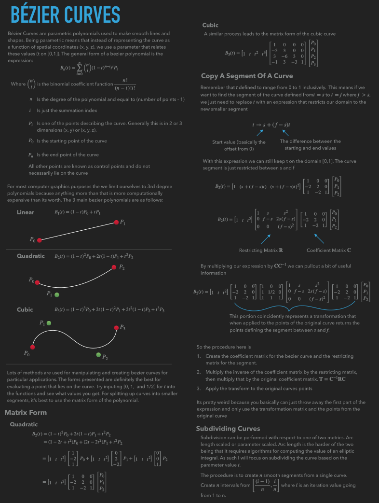

<p align="center">
    
</p>

<p align="center">
    
    
    
    
</p>


Bez is a swift package aimed at making Bézier curves easy to work with and manipulate. 

(Forked from [Kieran](https://github.com/kieranb662))

Try out all that bez has to offer by creating your own shapes using the [bez editor](https://apps.apple.com/us/app/bez-editor/id1508764103) app available for free on iOS 13.4 and greater. 

<p align="center">
  <a href="https://apps.apple.com/us/app/bez-editor/id1508764103">
  
  </a>
  </p>


The various utilities included are: 
* **Interpolation Functions**
* **Derivatives**
* **Arc Lengths**
* **Segmentation**
* **Subdivision** 
* **Lookup Table Generation**
* **Path Description -> Normalized SwiftUI Shape Conversion**

## Quick Start 

1. Snag that URL from the github repo 
2. In Xcode -> File -> Swift Packages -> Add Package Dependencies 
3. Paste the URL Into the box
4. Specify the minimum version number (1.0.5)
5. Copy/Paste the following snippet Into The ContentView.swift file

````Swift 
import SwiftUI
import bez

struct ContentView: View {
    @ObservedObject var polybezier: PolyBezier = PolyBezier(Circle().path(in: .init(x: 50, y: 100, width: 100, height: 100)))
    var body: some View {
        NavigationView {
            PathEditor(polybezier: _polybezier, name: "Shape",
                save:  { (name , path) in print(path)})
                .navigationBarTitle("Bez Editor", displayMode: .inline)
            
        }
    }
}

struct ContentView_Previews: PreviewProvider {
    static var previews: some View {
        ContentView().colorScheme(.dark)
    }
}
````

## Mathematical Background 




## Example Uses 

The `PSlider` component of the [Sliders](https://github.com/HeyRoseKay/SwiftUI-Sliders) SwiftUI Library 
<p align="center">

   </p>
